# 彩虹猫病毒样本的分析

最近对病毒源文件比较感兴趣,找了个彩虹猫的病毒源文件来进行分析。

### 病毒分析环境的详细介绍
```
    样本名称：MEMZ.exe
    MD5： 29550773947d03404b109ab6b808e5c4
    SHA1： 2413714dc7373eeb5f39ba952b6b2be4544cfdf6
    实验平台：windows7
    实验工具：LordPE,PEiD v0.95,IDA x32 v7.5,Ollydbg,VMWare WorkStation v15.5.6
```


## 运行过程
先在虚拟机上尝试运行查看触发的流程之间会出现一些较为不寻常的现象,
运行结果如图:

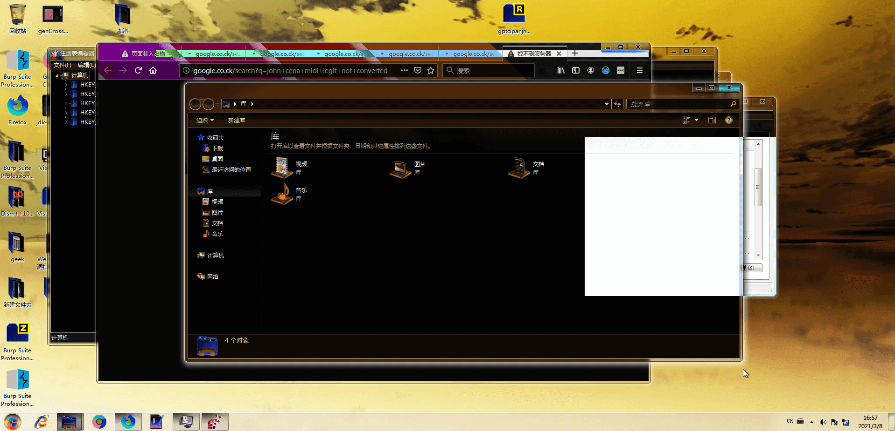

例如:
- 两个提醒弹窗和一个文档
- 连续跳出多个浏览器的搜索界面
- 鼠标出现莫名晃动且移动时出现异常图标
- 屏模颜色出现变化,连续出现系统提示音
- 在任务管理器中发现出现了6个MEMZ.exe进程

出现了这六个MEMZ.exe进程后,当用户尝试关闭任意一个或者进行系统重启时,都会遭到大量的弹窗以至最后蓝屏,之后windows将无法启动,之后屏幕上只会一直循环播放一只带有背景音乐的彩虹猫在哪里上下浮动。

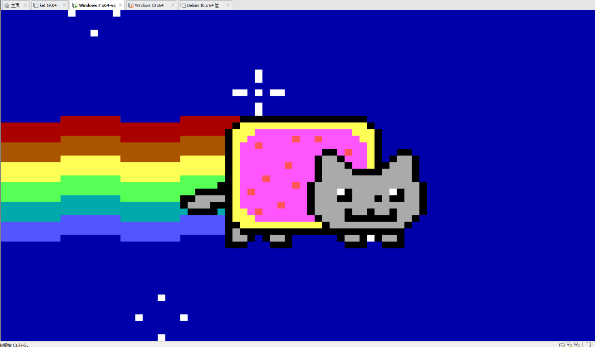


## 初步分析
**PEiD和LordPE分析**
现在开始分析,先进行查壳,看是否存在加密或者壳,如果有的话就得需要我们脱壳了。

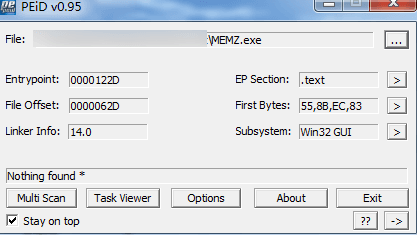

接着我们用LordPE来查看这个病毒样本的导入表,分析API,查看其中一些关键的敏感函数。

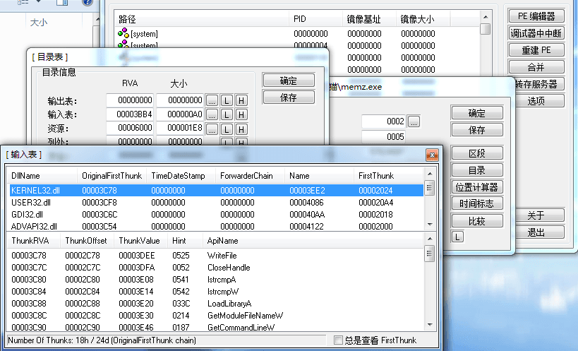

如下:
- 自动弹出多个浏览器窗口 `ShellExecute`

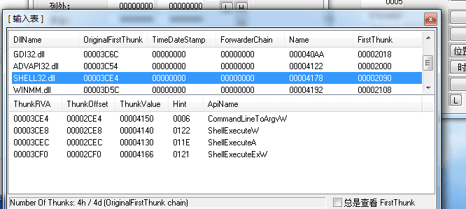

- 发出系统提示音 `PlaySoundA`


- 桌面颜色变化异常 `BitBlt`、`StretchBit`

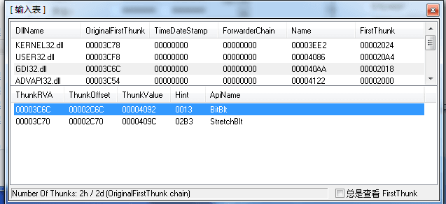

- 鼠标异常晃动 `SetCursorPos`、`GetCursorPos`


- 鼠标移动时桌面出现奇怪图标 `DrawIcon`

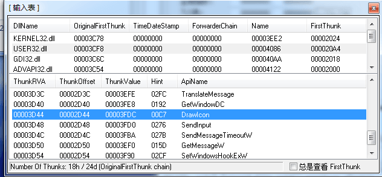

- 出现6个MEMZ进程 `ShellExecute`

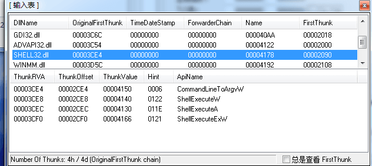

还能发现一些虽然不能直接关联，但常常成对出现并且能完成某些功能。
```
    OpenProcessToken、AdjustTokenPrivilege、LookUpPrivilegeValue--------给进程提权
    GetMessage、TranslateMessage、DispatchMessage-----------------------建立消息循环
    CreateToolhelp32Snapshot、Process32First、Process32Next-------------遍历进程
    SetWindowHookEx、UnhookWindowHookEx、CallNextHookEx-----------------给窗口下钩子
    LoadLibrary、GetProcAddress-----------------------------------------加载库并导入函数
```

## IDA分析
用IDA32打开MEMZ.exe,定位到入口函数start并且使用快捷键F5来获取伪代码,这功能能有效的提高我们对样本分析的效率。但有一点要记住这些伪代码只是IDA通过现有的信息来生成(也可以说是猜)出来的,并不能保证其百分之百的正确,有时也会影响我们的分析过程。

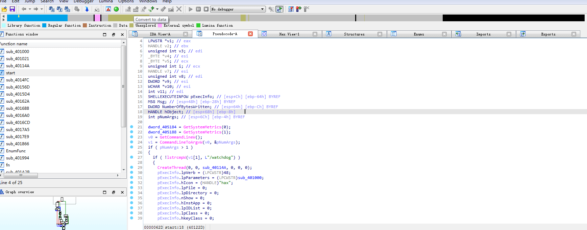

由上图我们可知:用`start函数`进入,首先调用 `GetCommandLine`和`CommandLineToArgv`两个函数来获取命令行参数。


### 无参部分
当程序无参数时,使用`MessageBox()函数`弹出两个名为`MEMZ`弹窗——刚执行时出现的两个确认窗口：

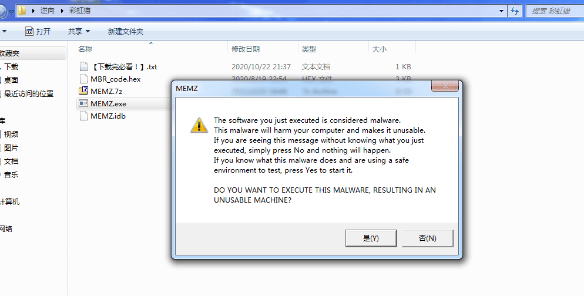

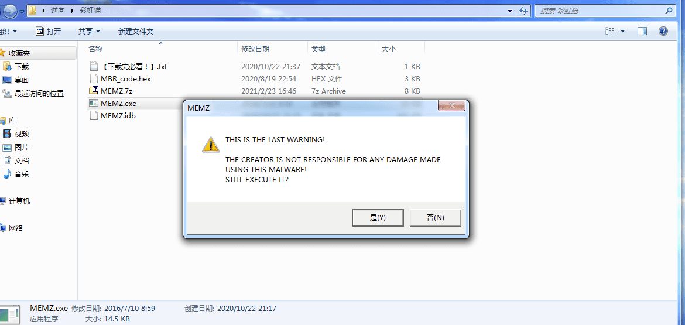

当这两次弹窗确认后,将获取进程的路径并存入`v10`中,接下来的`do while`执行5次循环,并且每次循环都调用一次`ShellExecuteW`,从而生成5个相同的进程,参数为`watchdog`:


5次循环结束后,用`ShellExecute`函数生成一个参数为`main`的进程,接下来的`SetPriorityClass`是给进程设置优先级的函数,多半是用来提权的,并且该函数的参数为`0x80u`,这也就意味着该`/main`进程的优先级应该是最高的。

经过这一系列分析,我们终于知道在运行过程中的6个`MEMZ.exe`是怎么来的了,由最开始的双击从而生成一个原始进程,之后原始进程生成了5个`/watchdog`进程和一个`/main`进程,之后原始进程就第一时间将自己干掉,因此这就是为什么我们打开任务管理器时,存在6个`MEMZ.exe`进程的原因了。


### 有参数的部分--watchdog
程序对参数的判断有两个:一为"watchdog",一为"main"。
判断获取的参数是否为watchdog,是则向下执行,之后则调用CreateThread来创建线程。

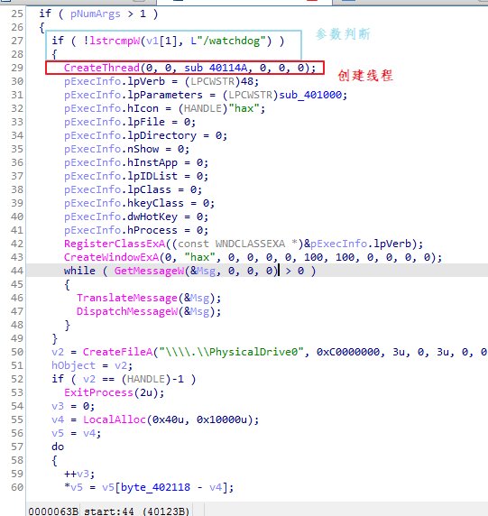


### /main部分
这里借鉴了52pojie上的`buzhifou01`和`我是狗哥`大佬的分析,并增加了自己的一些理解和分析。

MBR(主引导记录),也被称为主引导扇区,整个硬盘开头的512个字节就是它,分别为开头的446字节内容特指为“主引导记录”(MBR)，其后是4个16字节的“磁盘分区表”(DPT)，以及2字节的结束标志(55AA)。
每当计算机启动后会运行MBR里的代码进行各种状态的检查和初始化的工作,然后再将控制权交给操作系统(更加简略的意思就是一个JMP指令跳到操作系统的起始代码),Windows就会被加载启动。

而彩虹猫病毒呢,它是直接覆盖了MBR部分,用自己的码进行了覆盖,并且不交出控制权,windows将无法启动。

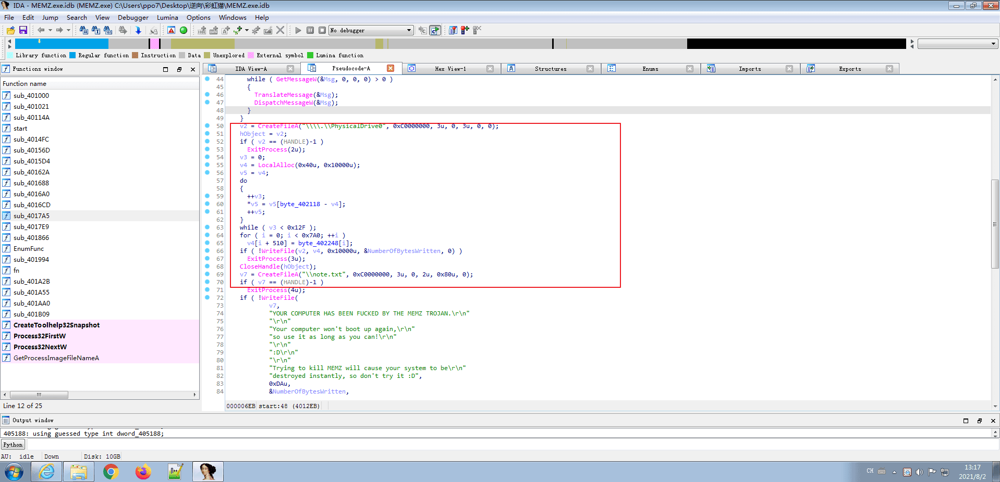

我们在OD中就能查看到当覆盖完主引导扇区的512个字节空间后写入的恶意代码。

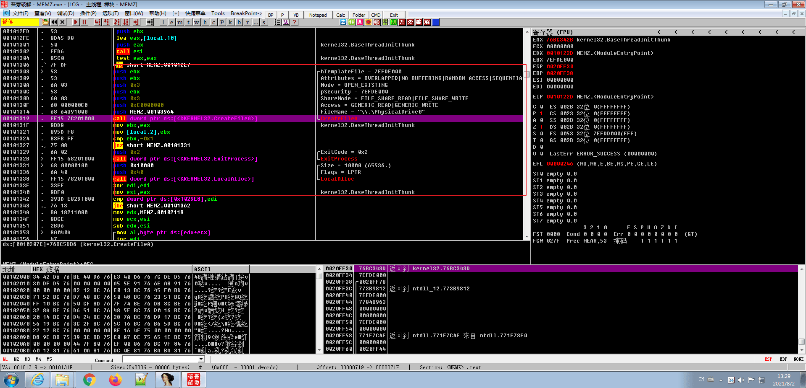

我们继续往下看,这里头有一个`do while`循环,/main的主要部分也就是这里。

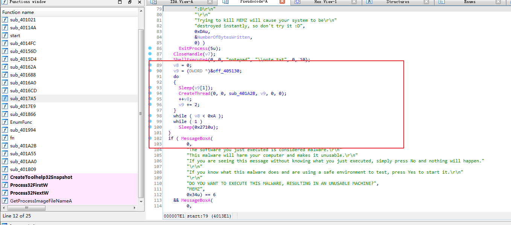

我们从上方的伪代码中可以发现,这部分的`do while`循环的计数器为`V8`,并且`CreatgeThread`用来创建线程,并循环了10次,一共创建了10个线程。我们继续深入,我们来看看这十个线程到底是用来做什么的,我们发现它其中还附带了一个参数`V9`并赋予初始值`off_405130`,而且每次循环时依次增加2。

我们继续深入发现,`off_405130`所关联的数据区中,这里的数据有着明显的规律性,分别为一`dd`和4`db`类型的数据组成,共10组。

**注**
汇编伪指令db，dw，dd
```
db(data byte)
    db定义字节类型变量，一个字节数据占1个字节单元.

dw(data word)
    dw定义字类型变量，一个字数据占2个字节单元。

dd(data dword)
    dd定义双字类型变量，一个双字数据占4个字节单元，读完一个。
```

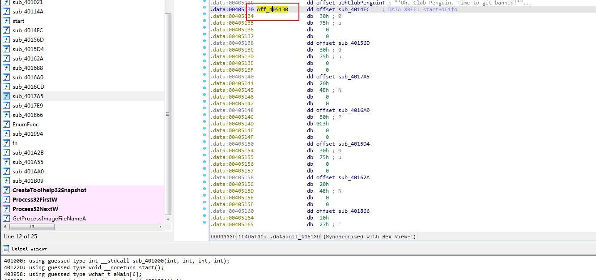


**程序运行中的一些分析**
1、批量运行浏览器软件,随机打开浏览器,并且运行任务管理器、注册表管理器。

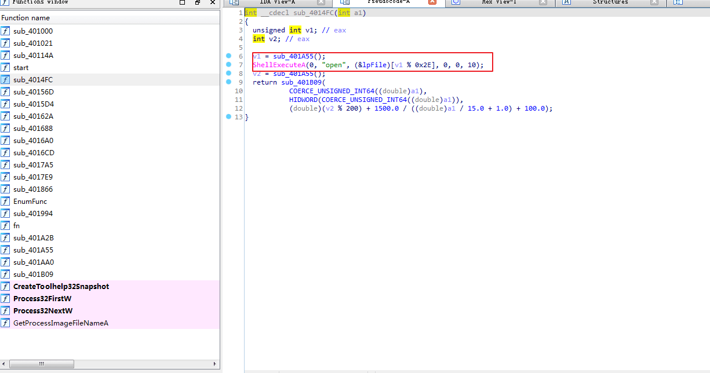

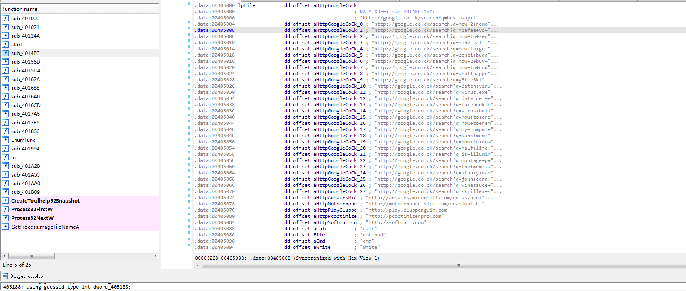

2、在文件夹中生成并打开记事本,显示信息。
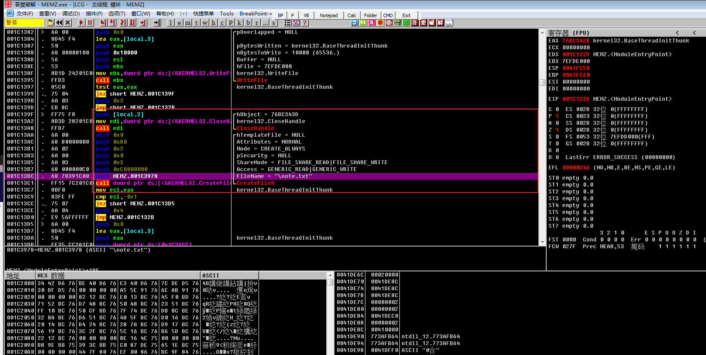

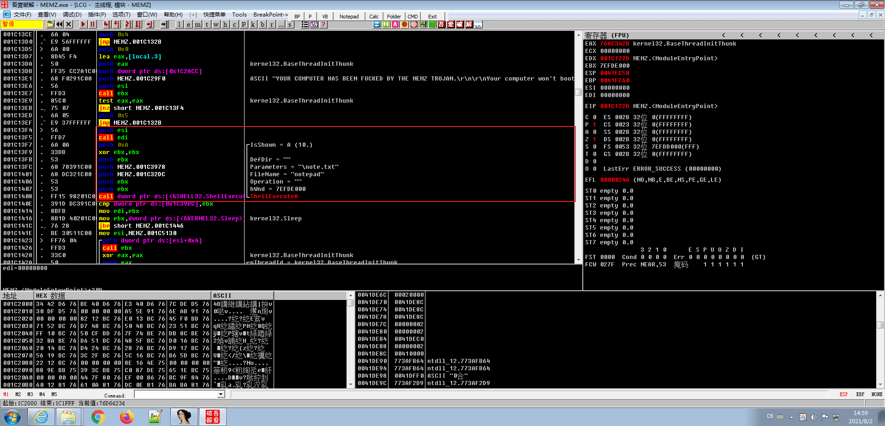

3、鼠标的异常抖动

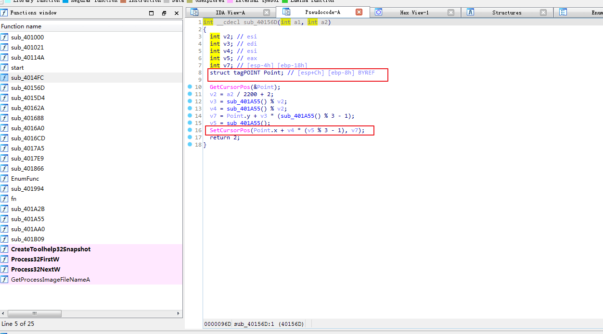

4、弹出“still using this computer”提示信息

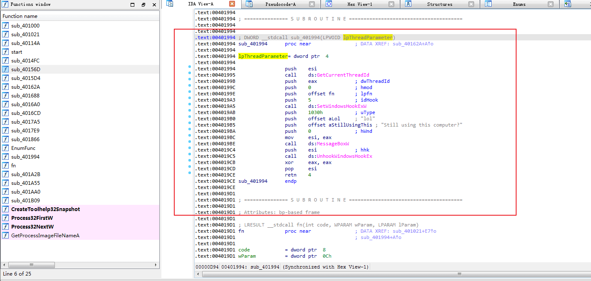

5、病毒运行时,发出声音,声音开始出现异常

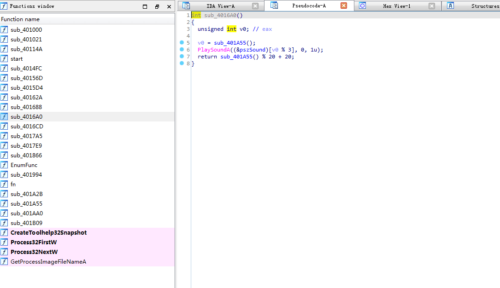

6、病毒运行过程中,桌面变色

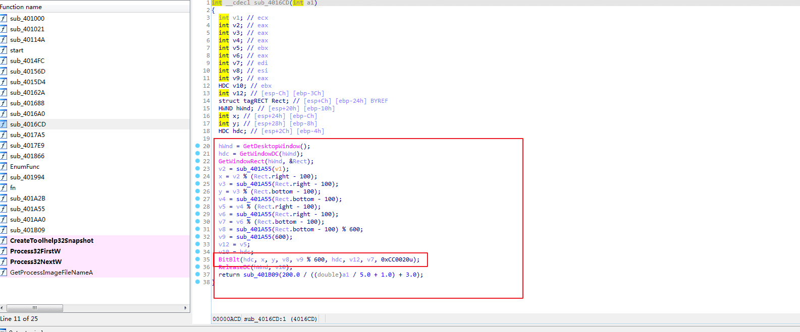


### sub_40114A函数
在该函数中,首先调用 `GetCurrentProcess` 和 `GetProcessImageFileName` 函数来获取此执行文件的路径,之后进入死循环中。在此循环中,`CreateToolhelp32Snapshot`用于拍摄进程快照,`Process32First`、`Process32Next`用于遍历进程,`GetProcessImageFileName`用于获取进程路径:

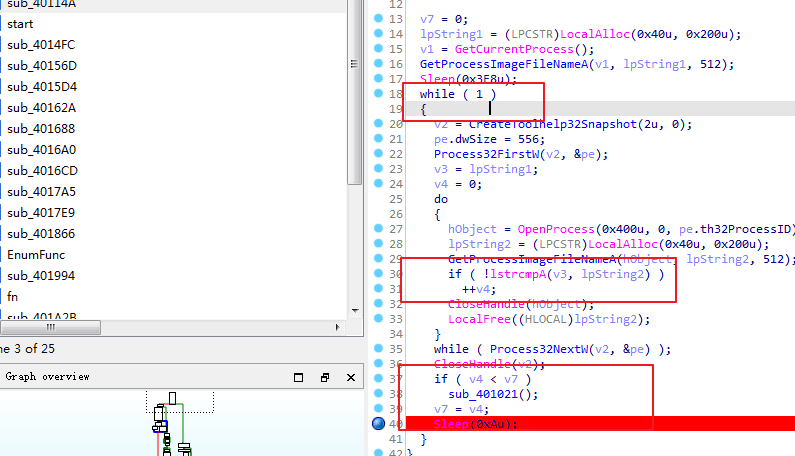

在这上图中我们可以看出这几个点:
- while循环是永真循环(死循环);
- 这个循环会比较其中的两个变量;
- 如果相同的话,其中v4会自增;
- 如果是v4>v7的话,就会进入另一个函数;
- v4每次循环都会重置0;
- V7每次循环都会被赋值v4的值;

我们在之前运行`彩虹猫`时,其过程中会生成6个`MEMZ.exe`的进程,并且当我们强制关闭一个进程时就会蓝屏,由此可知,上面这部分的大概意思就是检测进程数,一旦进程数小于6个的话,就会触发下面的`sub_401021`函数,使之蓝屏。


### sub_401000
在此函数中我们可以看到其对`Msg`进行了一个判断:其一为`16`,对应了`WM_CLOSE`WM_CLOSE;其二22则对应了`WM_ENDSESSION`。当其取值符合时，则跳转到`sub_401021`函数并触发蓝屏关机,相反则由`DefWindowProc`这个默认的窗口处理函数来进行操作(即不处理)。


### sub_401021
之后我们继续看`sub_401021`函数,一进来我们就看到`RtlAdjustPrivilege`和`NtRaiseHardError`,这两个放在一起的话就是个经典的蓝屏手段,前者提权后者使之蓝屏。


我们还能在其中看到:
- `GetCurrentProcess`和`OpenProcessToken`-------用于打开进程ToKen
- `LookupPrivilegeValueW`-----------------------查看系统权限的特权值
- `AdjustTokenPrivileges`-----------------------指定访问令牌的权限

所以我们能推断,在`sub_40114A`函数中调用`sub_401021`函数就是为了在判断进程出减少时(强制停止MEMZ.exe进程),从而控制系统蓝屏。


