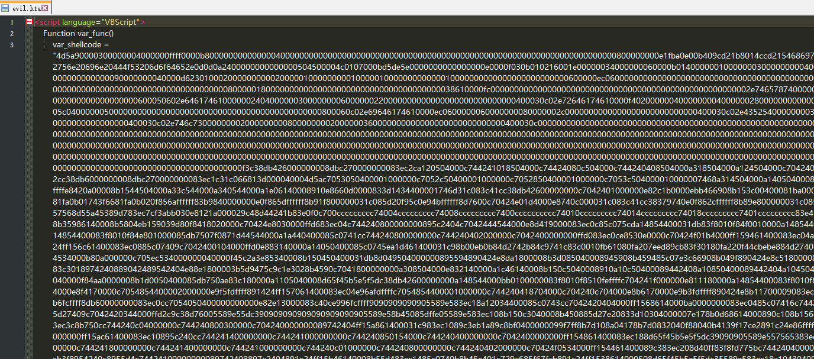
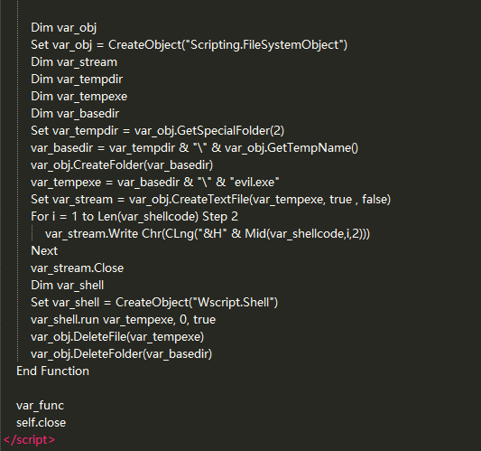
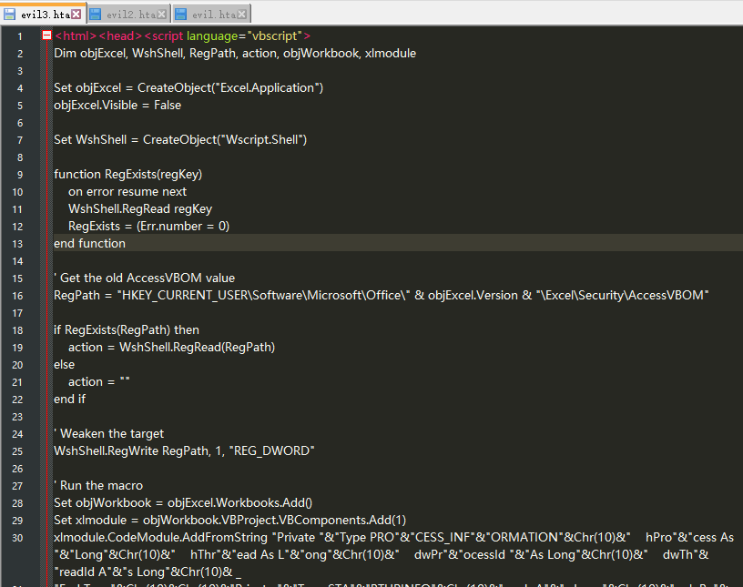
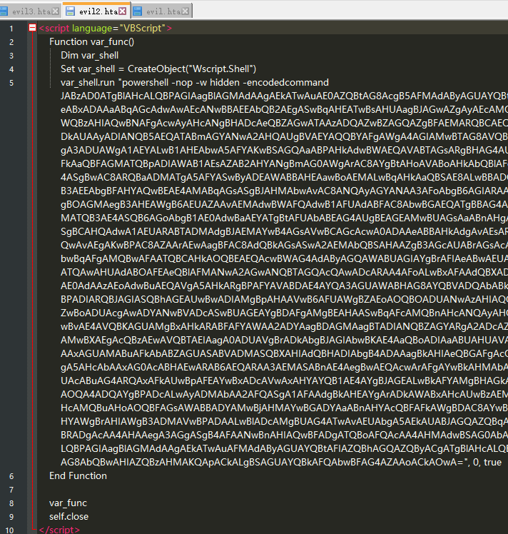
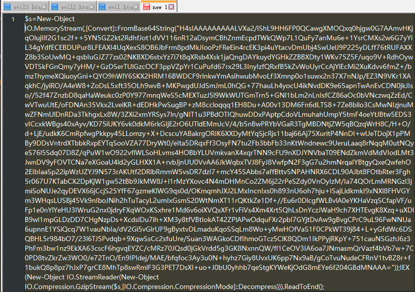

# README

CobaltStrike 提供 3 种生成 html 木马的方式 exe,powershell,vba,依次生成如下


**exe**



简单粗暴,直接包含一个 PE 文件在其中，



文件最后将 shellcode 释出为 evil.exe 并执行，这里文件名不一定是固定值,尝试通过正则进行匹配。

```
rule html_exe
{
    strings:
        $string="evil.exe"
        $string2="var_shellcode"
        $reg1= /var_tempexe = var_basedir & \"\\\" & \"[A-z]{1,20}.exe\"/
    condition:
        filesize < 100KB and $string and $string2 and $reg1
}
```


**vba**

查看 vba 版的html马



中间一大段为混淆的 vba 代码


通过 & 符号拼接由 chr 函数转换的 ascii
```
&Chr(10)&
```

这里比较容易找到特征,比如 myAr"&"ray


```
rule html_vba
{
    strings:
        $string="Wscript.Shell"
        $string2= "myAr\"&\"ray \"&Chr(61)&\" Array\"&Chr(40)&Chr(45)&\"4\"&Chr(44)&Chr(45)&\"24\"&Chr(44)&Chr(45)&"
    condition:
        filesize < 100KB and $string and $string2
}
```


**powershell**

查看结构



同样的 base64 编码命令, 解码查看



这里 $s=New-Object IO.MemoryStream 结合下文是将数据加载到内存中执行

> 在 cs3.14中是$s=New-Object IO.Memor

```
rule html_ps
{
    strings:
        $string= "Wscript.Shell"
        $string2= "var_shell.run \"powershell -nop -w hidden -encodedcommand"
        $string3= "var_func"
    condition:
        filesize < 100KB and $string and $string2 and $string3
}
```


